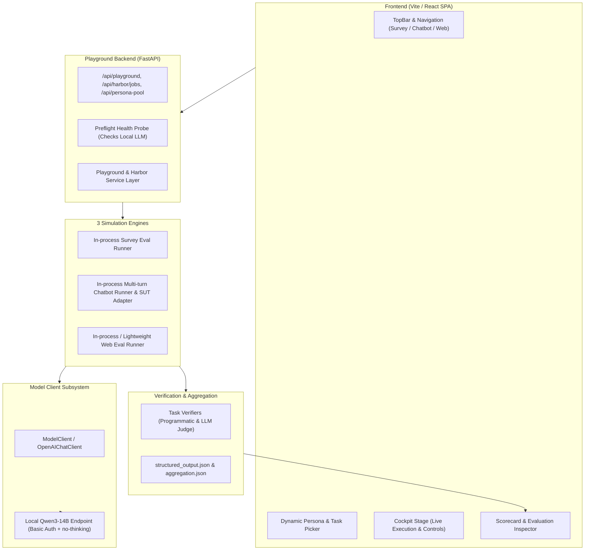

# Design Specification: MatrAIx Playground with Local Qwen3-14B & 3 Simulation Environments

## 1. Overview
This specification outlines the architecture, data flow, component changes, and verification plan for deploying the MatrAIx Playground application powered by a local **Qwen3-14B** LLM endpoint, tailored specifically for 3 simulation environments: **Survey**, **Chatbot**, and **Web**, while eliminating hardcoded restrictions and ensuring complete evaluation output.

---

## 2. Goals & Scope
- **Target LLM**: Local Qwen3-14B endpoint via `LOCAL_LLM_BASE_URL` (`http://localhost:8000/v1` default) with `Authorization: Basic <TOKEN>` and `chat_template_kwargs: {"enable_thinking": false}`.
- **Environments in Scope (3)**:
  1. **Survey**: Structured questionnaire simulation (e.g. Candy Land Price Sensitivity, Health Habits, Product Feedback).
  2. **Chatbot**: Multi-turn dialogue between Persona Agent and SUT (e.g. Meal Planning Nutrition, OpenBB Finance, Customer Support).
  3. **Web**: Web browsing and decision tasks (e.g. MIT OCW Course Choice, Notion Plan Comparison, Book/Quote Choice).
- **Environment out of Scope**: OS-App / Mobile / AppWorld (removed from UI switches, task catalog filters, and runtime requirements).
- **Dynamic Persona Selection**: Enable selecting any specific Persona ID or attribute-filtered cohort from the pool directly in the UI.
- **Full Evaluation Output**: Ensure that every simulation run produces structured scorecard metrics, satisfaction ratings, trajectory traces, and verifier summaries.

---

## 3. Architecture & System Design



---

## 4. Detailed Component Changes

### 4.1. Local LLM Subsystem
- **`packages/playground/src/playground/openai_client.py`**:
  - Support passing custom headers (such as `Authorization: Basic ...`) and extra request parameters (`chat_template_kwargs: {"enable_thinking": False}`) to OpenAI chat completion requests.
- **`packages/playground/src/playground/model_client.py`**:
  - Add handling for `local/*` or `qwen3-14b` model identifiers and default fallback to the configured `LOCAL_LLM_BASE_URL` and `LOCAL_LLM_AUTH_HEADER`.
  - Handle JSON extraction cleanly from Qwen3-14B completions without erroring on markdown formatting or thinking traces.
- **`application/playground/backend/service/config.py`**:
  - Add `local/qwen3-14b` ("Qwen 3 14B Local") as the primary and default persona model option.
  - Set `DEFAULT_PERSONA_MODEL = "local/qwen3-14b"`.
- **`application/playground/backend/api/app.py`**:
  - In `preflight_checks()`, probe the local LLM endpoint. If reachable, mark Model credentials as `ok: True`.
- **`application/playground/.env.local`**:
  - Define local LLM environment variables:
    ```env
    MATRIX_PERSONA_MODEL=local/qwen3-14b
    LOCAL_LLM_BASE_URL=http://localhost:8000/v1
    LOCAL_LLM_AUTH_HEADER="Basic <AUTH_TOKEN>"
    LOCAL_LLM_MODEL=Qwen3-14B
    ```

### 4.2. Simulation Environments (Survey, Chatbot, Web)

1. **Survey Environment**:
   - Uses `InprocessSurveyEvalRunner` with the Qwen3-14B model client.
   - Parses the Persona context bundle (1290 dimensions) and the questionnaire prompt.
   - Model generates answers in JSON format with choices and rationales.
   - Computes Likert means, completion percentage, validity checks, and outputs `structured_output.json` for the scorecard.

2. **Chatbot Environment**:
   - Supports both external sidecars (if started) and a built-in Conversational SUT Adapter (driven by Qwen3-14B) for nutrition, finance, and customer service tasks.
   - Persona agent maintains multi-turn conversation goals, state transitions, and constraints.
   - Evaluates conversation satisfaction, records move transitions, and generates complete trajectory bubbles and debrief metrics.

3. **Web Environment**:
   - Lightweight in-process web runner for course selection, pricing comparison, and product search tasks.
   - Presents HTML/DOM snapshots to the Persona Agent via Qwen3-14B.
   - Records actions, selected item/plan ID, reasons, and produces web debrief evaluation (`overallExperienceRating`, `needSatisfaction`, `easeOfUse`).

### 4.3. UI Tidy-Up & Elimination of Hardcoding
- **`application/playground/frontend/src/components/cockpit/TaskTypeSwitch.tsx`**:
  - Remove `os-app` option from `OPTIONS`, keeping: `Survey`, `Chatbot`, `Web`.
- **`application/playground/frontend/src/components/TaskGalleryContent.tsx`**:
  - Remove `os-app` from `TYPE_FILTERS`.
- **`application/playground/frontend/src/lib/personaAgentCatalog.ts`**:
  - Add `local/qwen3-14b` with label `"Qwen3-14B (Local)"` to the persona model options.
- **Frontend Type Fixes**:
  - Fix `LegacyRef` typing in `PersonaStoreContent.tsx`.
  - Fix `path?: string | null` in `lib/types.ts`.
- **Specific Persona Selection**:
  - Ensure users can type or select any specific `persona_id` from the UI to launch a trial immediately.

---

## 5. Verification Plan

1. **Unit & API Testing**:
   - Test LLM Client calling Qwen3-14B endpoint with Basic Auth and verifying valid JSON response.
   - Test `GET /api/preflight` returns `ready: True`.
   - Test Survey trial execution and ensure `structured_output.json` and metrics are produced.
   - Test Chatbot trial execution and verify multi-turn trajectory and evaluation scorecard.
   - Test Web trial execution and verify selected product and satisfaction ratings.
2. **Frontend Build & Integration**:
   - Execute `npm run build` in `application/playground/frontend` without TypeScript or bundle errors.
   - Launch FastAPI backend + static frontend via `./run_demo.sh`.
   - Verify UI renders Survey, Chatbot, and Web cleanly, allows choosing specific personas, runs tasks, and shows live evaluation scorecards.
